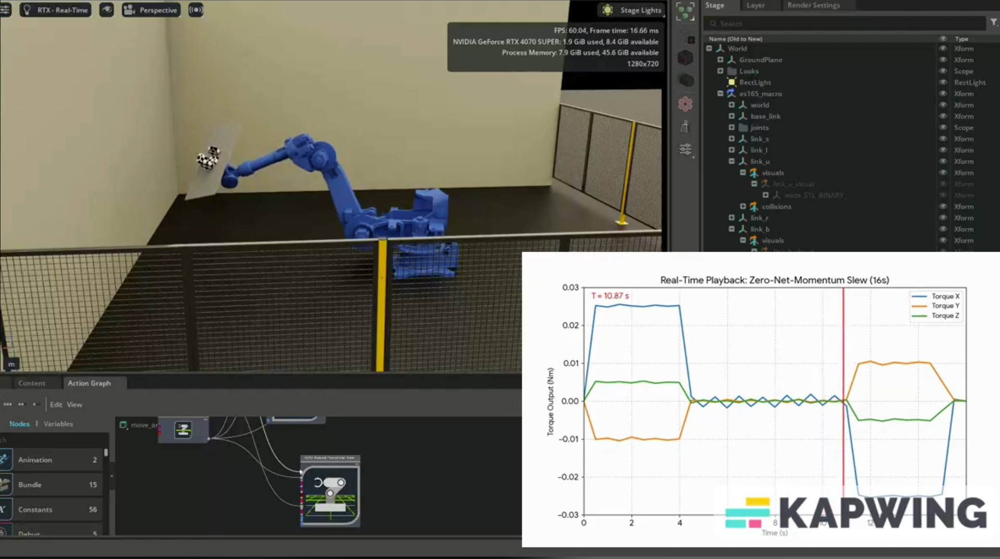

<p align="center">
  
</p>

# Isaac Sim · ROS 2 · MoveIt — ES165 Workspace

This repository is a **ROS 2 colcon workspace** for simulating and controlling a **Motoman ES165-class six-axis industrial arm** together with **reaction-wheel (RW) disturbance modeling**, **MoveIt 2**, and **MoveIt Servo**. It is designed to work with **NVIDIA Isaac Sim** (Omniverse) as the physics and visualization backend: launches default to **`use_sim_time:=true`** so the stack tracks the simulator clock and joint interfaces that bridge Isaac to **ros2_control**.

The cover image reflects the intended workflow: ES165 digital twin (`es165_macro`), Omniverse **Action Graph** logic, and **time-series torque profiles** (e.g. zero-net-momentum slew) driving the closed-loop arm response.

---

## Table of contents

1. [Executive summary](#executive-summary)  
2. [Technology stack](#technology-stack)  
3. [Functional architecture](#functional-architecture)  
4. [ROS 2 interfaces (reference)](#ros-2-interfaces-reference)  
5. [Nodes and executables](#nodes-and-executables)  
6. [MoveIt, Servo, and ros2_control configuration](#moveit-servo-and-ros2_control-configuration)  
7. [Launch files (detailed)](#launch-files-detailed)  
8. [Torque profiles and CSV tooling](#torque-profiles-and-csv-tooling)  
9. [Isaac Sim integration notes](#isaac-sim-integration-notes)  
10. [Build, run, and dependencies](#build-run-and-dependencies)  
11. [Repository layout](#repository-layout)  
12. [Known gaps and maintenance notes](#known-gaps-and-maintenance-notes)  
13. [Maintainer, license, acknowledgments](#maintainer-license-acknowledgments)

---

## Executive summary

| Capability | Implementation |
|------------|----------------|
| **Robot model** | Xacro/URDF (`es165.xacro`, `es165_macro`), SRDF semantic model (`es165d.srdf`), fixed `virtual_joint` from `world` → `base_link`. |
| **Motion planning** | MoveIt 2 **`move_group`**, **OMPL** pipeline, kinematics and joint limits from `es165_moveit_moveit_config`. |
| **Real-time servoing** | **MoveIt Servo** (`servo_node_main`): Cartesian **twist** in → smoothed **`JointTrajectory`** out to `arm_controller/joint_trajectory`. |
| **Disturbance / “zero-G” coupling** | **`zero_g_servo`**: integrates \(\tau\) with a diagonal **EE inertia** matrix, publishes **angular** `TwistStamped` to Servo (linear twist forced to zero). |
| **Reaction wheels** | Four semantic groups `rw1_ctrl` … `rw4_ctrl`; optional **`torque_from_rw`** (Iα → `/torque_input`) and **`control_rw`** (separate Servo stacks per wheel). |
| **Scripted torques** | **`publish_torque_profile`**: replay line-based `.profile` files to `/torque_input`. |
| **Operator UI** | **`gui`** (PyQt6): reset, pose, manual torque, RW speeds, profile controls; telemetry from `/joint_states`, `/ee_pose`, Servo status. |
| **Visualization / analysis** | RViz configs, **`publish_scene_mesh`** (`/scene_mesh`), **`visualize_pcd`** (reachable cloud — paths need localizing), optional **cuRobo** workspace script `calculate_free_space.py`. |

---

## Technology stack

Layers are ordered from simulation down to your application nodes.

### Simulation and graphics

| Component | Role |
|-----------|------|
| **NVIDIA Isaac Sim** | Physics, rendering, USD stage, Action Graphs, ROS 2 bridge (topics/services typical for Omniverse Isaac). |
| **USD / Omniverse** | Scene assets; `publish_scene_mesh` expects `usd/scene_mesh.stl` under the installed share tree. |

### Middleware and core ROS 2

| Component | Role |
|-----------|------|
| **ROS 2** | `rclpy`, `launch`, `ament_index_python`, standard messages (`geometry_msgs`, `sensor_msgs`, `trajectory_msgs`, `std_msgs`, `visualization_msgs`). |
| **DDS** | **eProsima Fast DDS**; repo ships **`fastdds.xml`** at workspace root: **UDPv4-only** participant (`useBuiltinTransports: false`, custom `UdpTransport`). Use when Isaac and ROS 2 must share a known transport profile (set `FASTRTPS_DEFAULT_PROFILES_FILE` to this file if needed). |

### Manipulation stack

| Component | Role |
|-----------|------|
| **MoveIt 2** | Scene monitoring, planning (`move_group`), SRDF groups, collision matrix, optional ground plane in SRDF. |
| **moveit_configs_utils** | `MoveItConfigsBuilder` in every launch file to load Xacro, SRDF, pipelines, controllers. |
| **launch_param_builder** | Loads merged Servo YAML into node parameters. |
| **MoveIt Servo** | Real-time streaming IK + collision-aware smoothing → `JointTrajectory` on `arm_controller/joint_trajectory` (see `servo_params.yaml`). |

### Control hardware abstraction

| Component | Role |
|-----------|------|
| **ros2_control** | `controller_manager` + **joint_state_broadcaster** + **joint_trajectory_controller** instances for arm and RWs (`ros2_controllers.yaml`). |
| **robot_state_publisher** | Publishes TF from robot description + `/joint_states`. |

### Application / scientific Python

| Library | Where it appears |
|---------|------------------|
| **NumPy** | Torque integration, RW axis math, profile parsing. |
| **PyQt6** | `gui` operator application. |
| **PyTorch**, **cuRobo**, **trimesh** | `calculate_free_space.py` (GPU collision / reachability style analysis; not wired as a default `colcon` entry point today). |
| **pye57** | Optional E57 export path in `visualize_pcd.py`. |

---

## Functional architecture

### Control loop (arm + Servo)

1. **Joint states** arrive on `/joint_states` (launch comments reference bridging from Isaac as `/isaac_joint_states` → standard topic).
2. **MoveIt Servo** reads twists on `/servo_node/delta_twist_cmds` (private namespace resolved under node name `servo_node`).
3. Servo outputs **trajectories** to **`arm_controller/joint_trajectory`** with **position and velocity** command interfaces (`ros2_controllers.yaml`).
4. **`zero_g_servo`** treats `/torque_input` as a body-frame torque, updates an angular “velocity” state with \(\omega_{k+1} = I^{-1} \tau \,\Delta t + \omega_k\) (diagonal \(I\) in code), and publishes **`TwistStamped`** with **angular** components only; **linear velocity is zero** (EE position not driven by linear twist in this mode).

### Reaction-wheel path

- **`control_rw`** scales `/rw_speed` by `1e5` and publishes per-wheel **`TwistStamped`** to `/{rw1,rw2,rw3,rw4}_servo_node/delta_twist_cmds` with angular Z (per launch/RW framing).
- **`torque_from_rw`** differentiates RW speeds, applies **scalar inertia** (solid-cylinder model, CubeSpace CW1200–style mass/radius), maps each wheel to a **fixed 3D axis**, sums to net torque, publishes **`Float32MultiArray`** on `/torque_input`.

### Profile playback

- **`publish_torque_profile`** expands includes and executes **`T`** (torque set), **`A`** (hold duration with optional 4th element in message for dwell), **`W`** (wait), **`L`** (nested profile). Publishes to `/torque_input`; signals load state on `/profile_loaded`.

### Data flow (high level)

```mermaid
flowchart TB
  subgraph sim [Isaac Sim]
    PHY[Physics / joints]
  end
  subgraph ros [ROS 2 stack]
    RSP[robot_state_publisher]
    CM[controller_manager]
    MG[move_group]
    SV[servo_node]
    ZG[zero_g_servo]
    GUI[gui]
    PROF[publish_torque_profile]
    RW[torque_from_rw / control_rw]
  end
  PHY <-->|joint_states / commands| CM
  RSP --> TF[TF tree]
  MG --> SCENE[Planning scene]
  SV --> CM
  ZG --> SV
  GUI --> ZG
  PROF --> ZG
  RW --> ZG
  ZG -->|delta_twist_cmds| SV
```



---

## ROS 2 interfaces (reference)

### Topics (primary)

| Topic | Message types | Producer / consumer |
|-------|----------------|---------------------|
| `/joint_states` | `sensor_msgs/JointState` | Broadcaster → MoveIt, Servo, GUI |
| `/torque_input` | `std_msgs/Float32MultiArray` | Profile / GUI / `torque_from_rw` / tests → `zero_g_servo` |
| `/servo_node/delta_twist_cmds` | `geometry_msgs/TwistStamped` | `zero_g_servo` → MoveIt Servo |
| `/servo_node/start_servo`, `/servo_node/stop_servo` | `std_srvs/Trigger` | `zero_g_servo` clients |
| `/arm_controller/joint_trajectory` | `trajectory_msgs/JointTrajectory` | Servo + `zero_g_servo` (homing bursts) → controller |
| `/isaac_joint_commands` | `sensor_msgs/JointState` | `zero_g_servo` publisher (Isaac-oriented path) |
| `/tf_sim` | `tf2_msgs/TFMessage` | Sim → `zero_g_servo` (EE telemetry) |
| `/ee_pose` | `std_msgs/Float32MultiArray` | `zero_g_servo` → GUI (smoothed pose/velocity window) |
| `/rw_speed` | `std_msgs/Float32MultiArray` | GUI / `pub_angular_acc` → `control_rw`, `torque_from_rw` |
| `/{rwN}_servo_node/delta_twist_cmds` | `geometry_msgs/TwistStamped` | `control_rw` → RW Servo nodes |
| `/profile_path` | `std_msgs/String` | GUI → `publish_torque_profile` |
| `/start_profile`, `/stop_profile` | `std_msgs/Bool` | GUI → profile player |
| `/profile_loaded` | `std_msgs/Bool` | `publish_torque_profile` → GUI |
| `/reset`, `/update_position`, `/reset_speed` | `std_msgs/Bool` / `Float32MultiArray` | GUI → `zero_g_servo` |
| `/scene_mesh` | `visualization_msgs/Marker` | `publish_scene_mesh` → RViz |
| `pcd_points` | `sensor_msgs/PointCloud2` | `visualize_pcd` → RViz (see [Known gaps](#known-gaps-and-maintenance-notes)) |

### Test / ancillary topics

| Topic | Notes |
|-------|--------|
| `/start_pub`, `/torque_update` | `torque_publisher` test node |
| `/start` | `pub_angular_acc` gates decremented RW speed publish |

### Services

- **`/servo_node/start_servo`**, **`/servo_node/stop_servo`**: Trigger services used by `zero_g_servo` (and analogous names under RW servo nodes).

---

## Nodes and executables

Console scripts are declared in `es165_moveit/setup.py`.

| Executable | Node name (typical) | Role |
|------------|---------------------|------|
| **`zero_g_servo`** | `zero_g_controller` | Torque → integrated angular rate → Servo twists; homing via joint trajectory; optional `/tf_sim` → `/ee_pose`; calls Servo start/stop. |
| **`torque_from_rw`** | `torque_from_rw` | `/rw_speed` → numeric derivative → `/torque_input`; subscribes `/arm_initialized`. |
| **`control_rw`** | `rw_control` | Starts four RW servos; streams twists from `/rw_speed`. |
| **`publish_torque_profile`** | `publish_torque_profile` | File-driven torque playback; multi-threaded executor. |
| **`gui`** | `gui_publisher_node` | PyQt6 front-end for operators. |
| **`visualize_pcd`** | `visualize_pcd` | Publishes reachability / map cloud; **hardcoded absolute paths** in source. |
| **`publish_scene_mesh`** | `scene_mesh_publisher` | STL mesh marker for RViz. |
| **`angle_intercepter`** | `angle_intercepter` | Subscribes `*_controller/joint_trajectory_goobert`, wraps RW joint to ±2π, republishes to `*_controller/joint_trajectory`. |
| **`pub_angular_acc`** | `pub_angular_acc` | When `/start` true, decrements a stored RW speed vector and publishes `/rw_speed` at 10 Hz (test / ramp helper). |
| **`torque_publisher`** | `test_control` | Publishes constant or updated torque to `/torque_input` when `/start_pub` enabled. |
| **`point_move`** | (deprecated) | Legacy trajectory reference. |

**Not registered in `setup.py` but referenced by launches**

- **`get_occupancy.launch.py`** runs executable **`calculate_available_space`** — there is no matching `console_scripts` entry; workspace analysis lives in **`calculate_free_space.py`** as a standalone module. Treat **`get_occupancy.launch.py` as incomplete** until an entry point is added or the launch is retargeted.
- **`robot_servo.launch.py`** includes **`zero_g_position_controller`**, which only exists under **`old_cuda_stuff/`** and is **not** installed; that launch path may fail unless you restore/install that node.

---

## MoveIt, Servo, and ros2_control configuration

### Semantic model (`es165d.srdf`)

- **Planning group `arm`**: `joint_1_s` … `joint_6_t`.
- **RW groups**: `rw1_ctrl` … `rw4_ctrl` (`rw1_joint` … `rw4_joint`).
- **Named states**: `arm_ready`, `arm_home`.
- **Virtual joint**: `world` → `base_link`, **fixed**.
- **Collision exclusions**: Adjacent-link pairs plus EE / RW adjacency; optional **ground plane** collision object block in SRDF.

### Arm Servo (`config/servo_params.yaml`) — highlights

- **Command in**: `speed_units`; **command out**: `trajectory_msgs/JointTrajectory` → `arm_controller/joint_trajectory`.
- **Publish period** ~33 ms; **Butterworth** online smoothing plugin.
- **Planning frame**: `base_link`; **EE frame**: `ee_base_link`; **move_group_name**: `arm`.
- **Collision checking** enabled with self/scene proximity thresholds; singularity thresholds configured.

### ros2_control (`config/ros2_controllers.yaml`)

- **Manager update rate**: 100 Hz.
- **`arm_controller`**: joints `joint_1_s` … `joint_6_t`; command interfaces **position** and **velocity**; state **position** and **velocity**.
- **`rw1_controller` … `rw4_controller`**: single joint each (`rwN_joint`), position command interface (see YAML for full parameters).

---

## Launch files (detailed)

| File | Nodes brought up | Notes |
|------|------------------|-------|
| **`main.launch.py`** | `robot_state_publisher`, `ros2_control_node`, spawners (`joint_state_broadcaster`, `arm_controller`), `move_group`, `servo_node`, `zero_g_servo` (after arm spawn), `publish_torque_profile`, `gui` | Primary “operator + profile + zero-G” stack. Default `use_sim_time:=true`. |
| **`control_with_rw.launch.py`** | Same core as above **minus** GUI/profile; adds `torque_from_rw`, `control_rw`, `pub_angular_acc` | Closed loop from RW speeds → torque → arm; test ramp via `pub_angular_acc`. |
| **`rw_with_visualization.launch.py`** | Full arm stack + **four** `moveit_servo` instances (`rw1`…`rw4` params) + RW spawners + `control_rw` + `torque_from_rw` | Comment in launch: RW visualization **not physically accurate** yet. Uses **TimerAction** / extended graph — inspect file when debugging ordering. |
| **`robot_servo.launch.py`** | Similar to main + optional RViz; includes **`zero_g_position_controller`** and commented **`torque_publisher`** | **May not run** without restoring `zero_g_position_controller` install. |
| **`manual_control_rviz.launch.py`** | RSP, ros2_control, MoveIt, RViz-oriented manual control | `LOG_LEVEL` default INFO. |
| **`pcd_visualization_rviz.launch.py`** | RViz + `robot_state_publisher` using **`es165_blender_absolute_paths.urdf`** | Launch references that filename; the repo currently ships **`es165_blender.urdf`** — align the launch path or add the absolute-path URDF before use. Subscribes to **`pcd_points`**. |
| **`get_occupancy.launch.py`** | RSP, ros2_control, `move_group`, **`calculate_available_space`** | Executable mismatch — see [Known gaps](#known-gaps-and-maintenance-notes). |

---

## Torque profiles and CSV tooling

### `.profile` language (as implemented)

- **`T tx ty tz`** — Set torque vector (Nm); semantics tied to `publish_torque_profile` state machine (hold / apply pairing with **`A`**).
- **`A dt`** — Duration / dwell step (pairs with preceding torque in queue).
- **`W seconds`** — Wall-clock sleep in profile playback.
- **`L other.profile`** — Include another file from the same `config/` directory (recursive `get_queue`).

Files such as `tumble.profile`, `full_profile_detumble.profile`, `genAI_mock_mission.profile` live under `src/es165_moveit/config/`.

### `make_profile.py` (workspace root)

Reads **`data_zerosum.csv`** columns **`Time (s)`**, **`Torque X (Nm)`**, **`Torque Y (Nm)`**, **`Torque Z (Nm)`** and writes **`profile.txt`** with `T` lines and `A` delta-time lines between samples — suitable as a starting point for hand-edited profiles.

---

## Isaac Sim integration notes

1. **Time**: Pass **`use_sim_time:=true`** (default) and ensure Isaac (or your bridge) publishes **`/clock`** so TF, Servo, and controllers stay synchronized.
2. **Joint interface**: Comments in launches refer to **`/isaac_joint_states`** feeding **`/joint_states`** via the bridge/broadcaster; confirm your Isaac ROS2 bridge matches topic names and joint names (`joint_1_s`, …).
3. **EE telemetry**: `zero_g_servo` optionally consumes **`/tf_sim`** for EE tracking; wire your sim to publish compatible **`tf2_msgs/TFMessage`** if you use `/ee_pose` in the GUI.
4. **Networking**: If discovery or SHM causes issues between Isaac and ROS 2 on Windows/Linux, the provided **`fastdds.xml`** UDP profile is a common fix — export **`FASTRTPS_DEFAULT_PROFILES_FILE=<workspace>/fastdds.xml`** before launching nodes.

---

## Build, run, and dependencies

### Build

```bash
cd /path/to/IsaacSim-ros2_workspace
colcon build --symlink-install
source install/setup.bash   # Linux
# install\setup.bat         # Windows cmd (per your ROS 2 install)
```

### Run examples

```bash
ros2 launch es165_moveit main.launch.py
ros2 launch es165_moveit control_with_rw.launch.py
ros2 launch es165_moveit rw_with_visualization.launch.py
ros2 launch es165_moveit manual_control_rviz.launch.py
ros2 launch es165_moveit pcd_visualization_rviz.launch.py
```

### Dependency checklist (conceptual)

- ROS 2 base, **controller_manager**, **robot_state_publisher**, **joint_state_broadcaster**, **joint_trajectory_controller**
- **moveit_ros_move_group**, **moveit_servo**, **moveit_configs_utils**, **launch_param_builder**
- Python: **numpy**, **PyQt6** (GUI), **tf_transformations** (or equivalent providing `tf_transformations` for `zero_g_servo`)
- Optional: **torch**, **curobo**, **trimesh**, **pye57** for specialized scripts

`package.xml` files still mark many **`<depend>`** entries as TODO; rely on your overlay (MoveIt install) plus runtime errors to catch missing packages until manifests are completed.

---

## Repository layout

```
IsaacSim-ros2_workspace/
├── src/
│   ├── es165_moveit/
│   │   ├── es165_moveit/          # Python package (nodes)
│   │   ├── launch/                # Launch descriptions
│   │   ├── config/                # *.profile, YAML snippets, velocities
│   │   ├── urdf/                  # Xacro, URDF variants
│   │   ├── rviz/                  # default.rviz
│   │   ├── old_cuda_stuff/        # Legacy XRDF / zero_g_position_controller
│   │   └── blender_files/         # Blender export artifacts
│   └── es165_moveit_moveit_config/
│       └── config/                # es165.xacro, es165d.srdf, controllers, servo YAML
├── fastdds.xml
├── make_profile.py
├── data.csv, data_zerosum.csv
└── robotic_arm.png
```

---

## Known gaps and maintenance notes

| Issue | Detail |
|-------|--------|
| **`get_occupancy.launch.py`** | Invokes **`calculate_available_space`**, which is **not** in `setup.py` **`console_scripts`**. Either add an entry point wrapping `calculate_free_space.py` or change the launch executable name. |
| **`robot_servo.launch.py`** | References **`zero_g_position_controller`** only under **`old_cuda_stuff/`** — not installed by default. |
| **`visualize_pcd.py`** | Contains **hardcoded absolute paths** (`/home/oligo/...`) and a pickle path; must be parameterized for portable use. |
| **`pcd_visualization_rviz.launch.py`** | Points to **`es165_blender_absolute_paths.urdf`**; only **`es165_blender.urdf`** is present under `urdf/` in this checkout. |
| **`pub_angular_acc.py`** | Imports **`torch._numpy`** / **sympy** unused paths — fragile in clean environments; consider trimming imports. |
| **Package manifests** | `package.xml` **TODO** description/license; **`install_requires`** in `setup.py` is minimal — document system deps in this README or manifests. |

---

## Maintainer, license, acknowledgments

- **Maintainer** (from manifests): **oligo** (emails in `package.xml` / `setup.py`).
- **License**: Not finalized in `package.xml` — set before redistribution.
- **Third party**: **NVIDIA** (Isaac Sim, Fast DDS profile header), **MoveIt 2**, **ROS 2**. Cover image may include export-tool watermarks — replace for public branding if needed.
